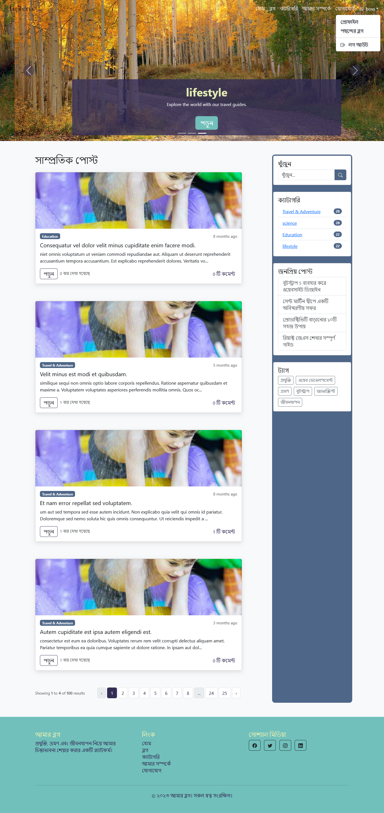
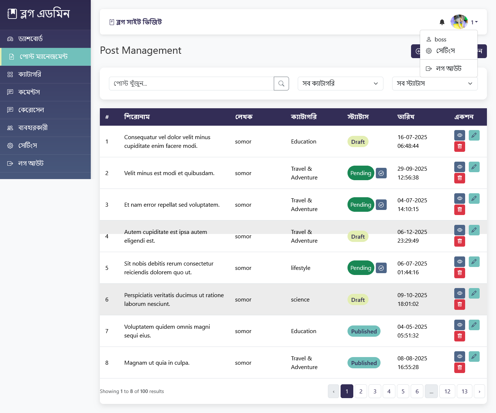
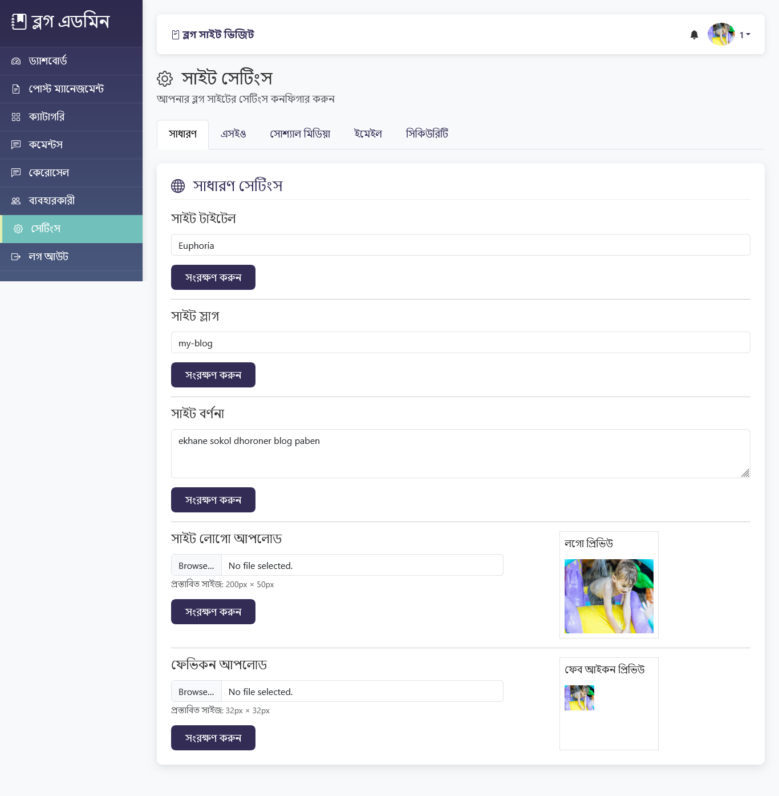

# 📝 Multi-User Dynamic Blog Platform

A robust and scalable blogging platform built with the **Laravel framework**, featuring a clean **MVC architecture**. This project demonstrates advanced web development practices including secure user authentication, multi-role authorization, dynamic content management (CRUD), and an intuitive admin dashboard. Optimized for performance and security, it leverages **Eloquent ORM** for seamless database interactions and **Blade templating** for a responsive UI.

---

## 🌟 Core Modules & Features

### 1. Advanced Role-Based Access Control (RBAC)
- **Super Admin:** Ultimate control over the entire system, including site settings, global content management, and user roles.
- **Editor:** Specialized access to moderate, edit, and manage blog posts across the platform.
- **User (Author):** Independent profile and post management. Users can create, update, and delete their own stories.
- **Authentication Guard:** Robust login and registration system handled via custom **Laravel Middleware**.

### 2. Dynamic Content & Category Engine
- **Full CRUD Functionality:** Seamlessly manage blog posts with title, content, and featured images.
- **Categorization:** Organize blogs into dynamic categories for enhanced navigation and SEO.
- **My Dashboard:** A personalized workspace for users to track and manage their published content.

### 3. Interactive Engagement System
- **Commenting Module:** Built-in discussion engine allowing readers to engage with authors.
- **Session-Based Access:** Comments are restricted to authenticated users to ensure a high-quality community environment.

### 4. Administrative Control Center
- **Dynamic Site Settings:** Update site identity (Logo, Favicon, Contact Info, Meta-tags) directly from the dashboard without touching code.
- **User Management:** Monitor, activate, or restrict user accounts and modify permissions on the fly.

---

## 🛠 Technical Stack


| **Layer**          | **Technology**                               |
| :----------------- | :------------------------------------------- |
| **Backend**        | PHP 8.x, Laravel Framework                  |
| **Frontend**       | Blade Templating, Bootstrap 5, JavaScript    |
| **Database**       | MySQL (Relational Schema)                   |
| **Middleware**     | Custom Authentication & Role Validation     |

---

## 🛡 Security Features

- **CSRF Protection:** Secure form handling to prevent cross-site request forgery.
- **SQL Injection Prevention:** Utilization of Eloquent and parameterized queries for all database interactions.
- **Role Isolation:** Middleware-level protection to prevent unauthorized access to Admin/Editor panels.
- **Password Hashing:** Industry-standard Bcrypt hashing for all user credentials.

---

## 📂 Project Structure & Architecture

### Models & Database Logic
- **User Model:** Manages multi-role identities and profile customization.
- **Post Model:** Handles content creation, slugs, and relational mapping to categories/users.
- **Category Model:** Stores hierarchical metadata for post organization.
- **Comment Model:** Manages user interactions with relational integrity.

### Service & Logic Layers
- **AuthService:** Handles granular authentication and middleware logic.
- **ContentEngine:** Manages file uploads (Featured Images) and CRUD operations.
- **SettingsProvider:** A global service to inject site-wide configurations (Logo, Links) into the frontend.

### Frontend & UI Components

- **Admin Command Center:** A comprehensive dashboard for high-level bloging system oversight.
- **Dynamic Settings Panel:** An intuitive interface for non-technical admins to update site branding and contact info.
---

## 📸 Interface Preview

### 🏠 Landing Page


### 🖥️ Management Dashboards

| **Admin Panel** | **User Workspace** |
| :--- | :--- |
|  |  |

---
## 🚀 Setup Instructions

1. **Clone the repository**
```bash
git clone https://github.com/dev-roni/laravel-blog.git
```
2.**Open/Enter to project folder**
cd laravel-blog

3.**Install all dependencies**
```bash
composer install
```
4.**.env file setup**
Generate a .env file using .env.example
```bash
copy .env.example .env
```
Set database name (DB_DATABASE=myblog)

5.**Generate Application Key**
```bash
php artisan key:generate
```
6.**Configure environment**

create a MySQL database named "myblog"

Set queue driver (QUEUE_CONNECTION=database recommended)

7.**Run migrations**
```bash
php artisan migrate
```
8.**Seed initial data**
```bash
php artisan db:seed
```
10.**link storage to access file**
```bash
php artisan storage:link
```
10.**Start development server**
```bash
php artisan serve
```
Access the project at http://127.0.0.1:8000

---
## 🔐 Default Credentials

After setting up the project, you can log in to the admin panel with the following information:


| Role | Email | Password |
| :--- | :--- | :--- |
| **Super Admin** | `boss@gmail.com` | `11111111` |
| **Editor** | `boss2@gmail.com` | `11111111` |
| **Demo User** | `boss3@gmail.com` | `11111111` |

> [!IMPORTANT]
> Be sure to change these passwords after hosting the project in a production environment.

---
